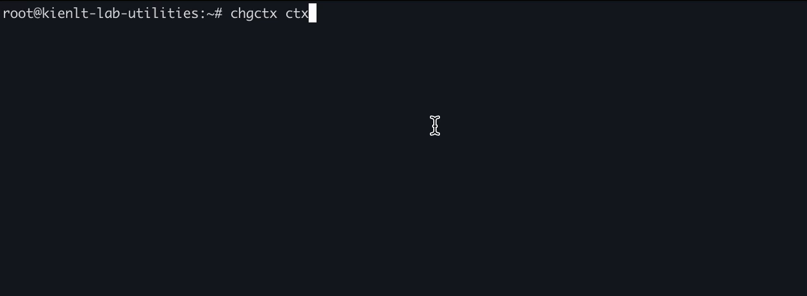
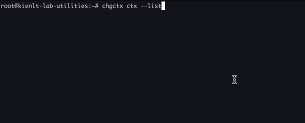
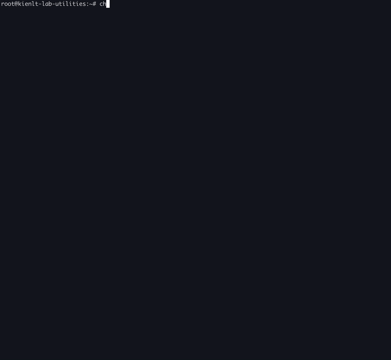

# ChgK8sCtx
Change K8S Context, a clone idea of kubectx and kubens for learning purpose.

Flat structure:
- My project is fucking small
- No need to make it complex or fancy LOL

# Feature
- make it works with idea of Kubectx and Kubens

# Usage
NOTE: You can see some print duplicate in previous ( showing triple line). It is fixed in v0.0.4 xD


- Change context with selection



- Change context with fuzzy selection xD



- Change context to previous context



# Build
Tested with `go version go1.25.0 darwin/arm64`
```bash
go mod tidy
go build -o chgctx .
```

# Run Unit Test
```bash
go test -v ./...
```

# Install from release

### Ubuntu/Linux (amd64)
```bash
curl -sL https://github.com/BlackMetalz/ChgK8sCtx/releases/latest/download/chgctx-linux-amd64 -o /tmp/chgctx && chmod +x /tmp/chgctx && sudo mv /tmp/chgctx /usr/local/bin/chgctx && chgctx -v
```

### macOS (Apple Silicon)
```bash
curl -sL https://github.com/BlackMetalz/ChgK8sCtx/releases/latest/download/chgctx-darwin-arm64 -o /tmp/chgctx && chmod +x /tmp/chgctx && sudo mv /tmp/chgctx /usr/local/bin/chgctx && chgctx -v
```

