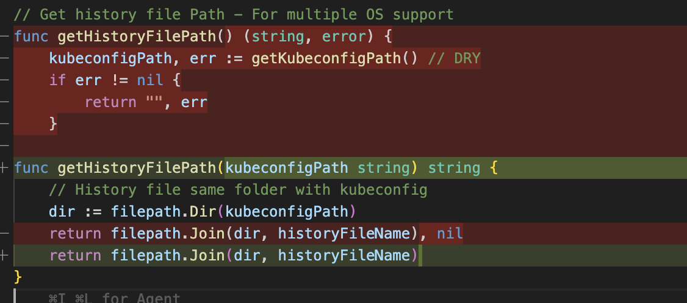

# Day 11 - Mar 09, 2026

### Issue duplicate print message related using default kubeconfig path while making demo

Hmm, seem like related to `getHistoryFilePath()` function, Gemini recommend solution: Dependency Injection (DI)



So basically, we would use passing argument instead of lets it find by itself.

And what is fixed?
- So inside `getHistoryFilePath()` function, we don't call `getKubeconfigPath` everytime function `getHistoryFilePath()` called

Previous
```go
func getHistoryFilePath() (string, error) {
	kubeconfigPath, err := getKubeconfigPath() // DRY
	if err != nil {
		return "", err
	}
```

After
```go
func getHistoryFilePath(kubeconfigPath string) string {
	// History file same folder with kubeconfig
	dir := filepath.Dir(kubeconfigPath)
	return filepath.Join(dir, historyFileName)
}
```

how many function using `getHistoryFilePath()` func?
- `savePreviousContext()` and `loadPreviousContext()` in `helper.go`

It maybe best practice in GO. And One more thing i learned: `Explicit is better than implicit`. It is easier to write test for function with argument than function without argument i believe!

And this shit fix only message when using function related to get/save previous context. Good to understand why!

