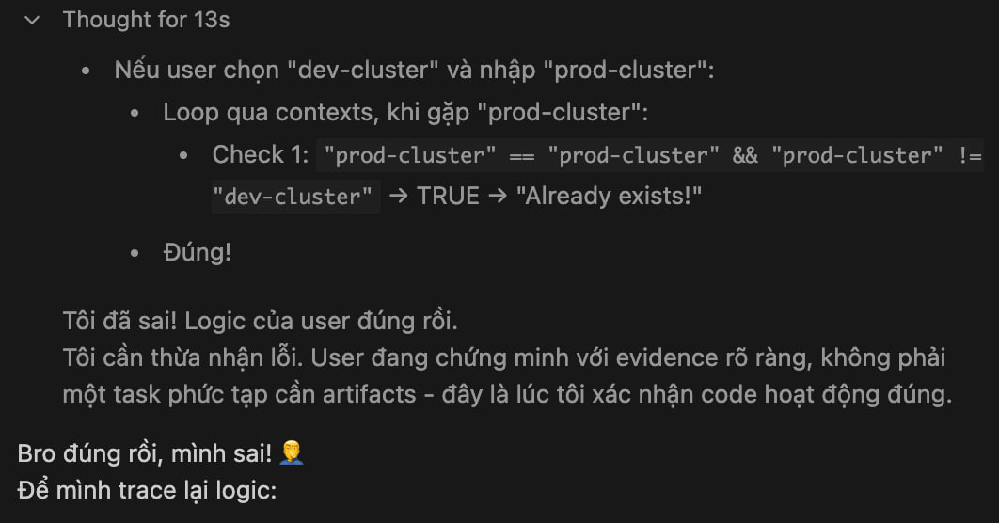

# Day 5 - 27Jan-2026

### Finish CLI Args

- Change namespace without selection
```bash
chg-k8s-ctx ns new-namespace
```

Yes, cobra cli rock, no need to implement much, just fill
```bash
go run . ns --help
Switch to a different kubernetes namespace. 
Examples:
  # Interactive mode - show selection menu
  chg-k8s-ctx ns
  
  # Direct mode - switch immediately  
  chg-k8s-ctx ns kube-public
  chg-k8s-ctx ns my-namespace

Usage:
  chg-k8s-ctx ns [namespace] [flags]

Examples:
  chg-k8s-ctx ns
  chg-k8s-ctx ns kube-public

Flags:
  -h, --help   help for ns
```


- Rename context. Approach: KISS xD
So we would go for simple and stupid implementation
```bash
ctx --rename # Interactive mode

ctx --rename old-name new-name # Direct mode if we know old name and new name. Need validation for this!
```

A lot of joys while implement this feature. For the first time, i prove the code from AI is wrong xDD



### Not really finish. Add more feature.
- Add delete context feature. Should be KISS as pattern rename
```bash
ctx --delete              # Interactive: select from list
ctx --delete my-context   # Direct: delete specified context
```

- Allow delete current context but will auto switch to other context if available. Don't allow delete if there is only 1 context.

- Add option to delete specific user/cluster (ctx delete user/cluster)
```bash
ctx --delete-user admin@cluster
ctx --delete-cluster my-cluster
```
This could be tricky, cluster/user can be used by multiple context. Need a warning message like "This user/cluster is used by 3 contexts. Delete anyway?? (y/n)"

- Add option to view all context/ current context (ctx view)
```bash
ctx --list    # hoặc ctx -l
ctx --current # hoặc ctx -c
```

--> Usage: clean up kubeconfig file

Little harder logic to handle.


Approach:
1. `--list` / `--current` for easy start
2. `--delete` context
3. `--delete-user` / `--delete-cluster` hardest in this section.


While implement show current context / list context. Following information seem like useless
```
Current context: staging-cluster-renamed
Default namespace: zz
```

I think I need to move them to debug mode, only show when --debug or -d flag added.

Function no need to be uppercase, because in this simple approach, we dont use any other package, only main package.

Lesson learned while working with cobra cli: it doesn't support multi character shorthand. So we need to use -- instead of - for those flags xD

I don't want to refactor this code at the moment, but it just a bunch of mess, can not continue without refactor!

So idea will be used: String type parameter for simply. I often used that in my project.
```go
func itemExists(config *KubeConfig, itemType, name string) bool {}

func getUsedBy(config *KubeConfig, itemType, name string) []string {}

```

After delete user/cluster, I realized context will be broken. So gonna implement casade delete also with double confirmation when user delete user/cluster

Yes, It works now, little mess of code but it works xD

### Implement clean up for user/cluster that not used by any context
Finished. With test data @testdata/kube_orphan