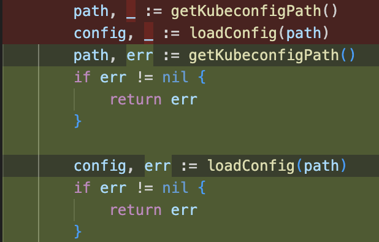

# Day 9 - Feb 19, 2026

### Refactor wrap errors
- in Day 3, i clear not understand how error should be wrap, it tooks me about 2 hours to figure it out!

- So I would pick consistent error wrapping style. Error should be wrap with `fmt.Errorf("context: %w", err)` and it will be returned inside function. 

Example: 



- And if we know that type is error, we can do something more like how we would handle if error appear!

- Example:
```go
package main

import (
	"errors"
	"fmt"
)

// Create new error type
var ErrInvalidID = errors.New("invalid id")

func getUser(id int) error {
	if id <= 0 {
		return fmt.Errorf("getUser: %w", ErrInvalidID)
	}
	return nil
}

func handleRequest() error {
	if err := getUser(-1); err != nil {
		return err
	}
	return nil
}

func main() {
	err := handleRequest()
	if err != nil {
		fmt.Println(err) // getUser: invalid id

		// With %w → We know it is ErrInvalidID 
        // Check err is ErrInvalidID or not
		if errors.Is(err, ErrInvalidID) {
			fmt.Println("==> Handle invalid id here!")
		}
	}
}
```